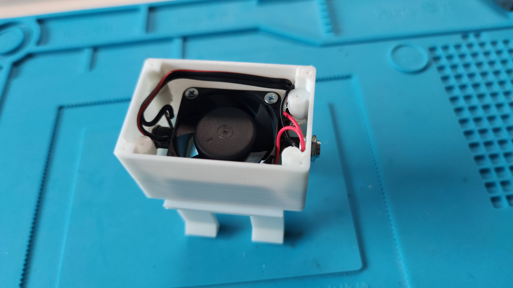

# Ficak (fičák) V1
Booster for T21 radiators.

## Introduction
As part of multiple energy saving activities in our house I did not find any "cool" solution for airflow booster attachable nicely to T21 radiators. And have to create one:

{width=250}

## 3D models
I created model of holder attachable into T21 radiators (only 66mm thick) and universal case for controller and 40mmx40mm fan.

{width=250}

### tinkercad models & STLs

[files](stl)

## Schematics

### NodeMCU tasmota configuration

### HA overview

## Photos

{width=250}
{width=250}
{width=250}
{width=250}
{width=250}
{width=250}
{width=250}
{width=250}
{width=250}
{width=250}
{width=250}
{width=250}
{width=250}
{width=250}
{width=250}
{width=250}

## Measurements

TBD - I will do some measurements and whole family subjective assessment during heating season ;-)
